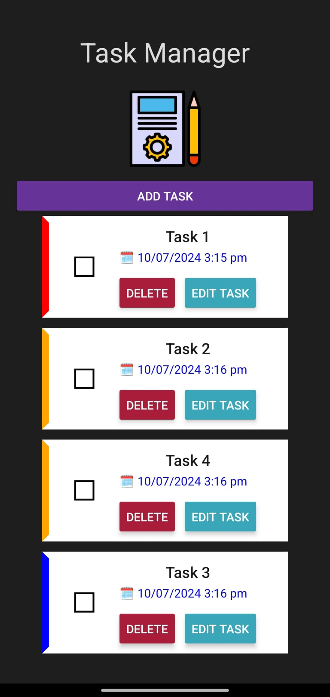

# Task Manager Application

This is a Task Manager application built with React Native and Expo. The app allows users to add, edit, delete, and mark tasks as completed.

## Table of Contents

- [Installation](#installation)
- [Running the Application](#running-the-application)
- [Folder Structure](#folder-structure)
- [Features](#features)
- [Screenshots](#screenshots)
- [Dependencies](#dependencies)
- [Contributing](#contributing)
- [License](#license)

## Installation

Follow these steps to install and run the application:

1. Clone the repository:
    ```bash
    git clone https://github.com/your-username/task-manager.git
    cd task-manager
    ```

2. Install the dependencies:
    ```bash
    npm install
    ```

3. Install Expo CLI globally if you haven't already:
    ```bash
    npm install -g expo-cli
    ```

## Running the Application

To run the application on your local machine:

1. Start the Expo development server:
    ```bash
    npm start
    ```

2. Use the Expo Go app on your mobile device or an emulator to scan the QR code generated by the Expo development server.

## Folder Structure

Here is the folder structure of the project:

task-manager/
├── assets/
│ ├── icon.png
│ ├── splash.png
│ └── taskManagerLogo.png
├── components/
│ ├── AddTask.jsx
│ ├── CustomCheckbox.jsx
│ ├── DeleteButton.jsx
│ ├── EditButton.jsx
│ └── SingleTask.jsx
├── App.js
├── app.json
├── package.json
├── README.md


- **assets/**: Contains images and other assets.
- **components/**: Contains the React components used in the app.
  - `AddTask.jsx`: Component to add a new task.
  - `CustomCheckbox.jsx`: Custom checkbox component to mark tasks as completed.
  - `DeleteButton.jsx`: Component for the delete button.
  - `EditButton.jsx`: Component for the edit button.
  - `SingleTask.jsx`: Component to display a single task.
- **App.js**: Entry point of the application.
- **app.json**: Configuration file for Expo.
- **package.json**: Lists dependencies and scripts.

## Features

- Add new tasks with a name and priority.
- Edit existing tasks.
- Delete tasks.
- Mark tasks as completed with a checkbox.

## Screenshots



## Dependencies

- `expo`: ~51.0.17
- `expo-status-bar`: ~1.12.1
- `react`: 18.2.0
- `react-native`: 0.74.3
- `react-native-dropdown-picker`: ^5.4.6
- `react-native-elements`: ^3.4.3
- `react-native-modern-datepicker`: ^1.0.0-beta.91
- `react-native-vector-icons`: ^10.1.0

## Contributing

Contributions are welcome! Please fork this repository and submit a pull request for any changes.

## License

This project is licensed under the MIT License.
